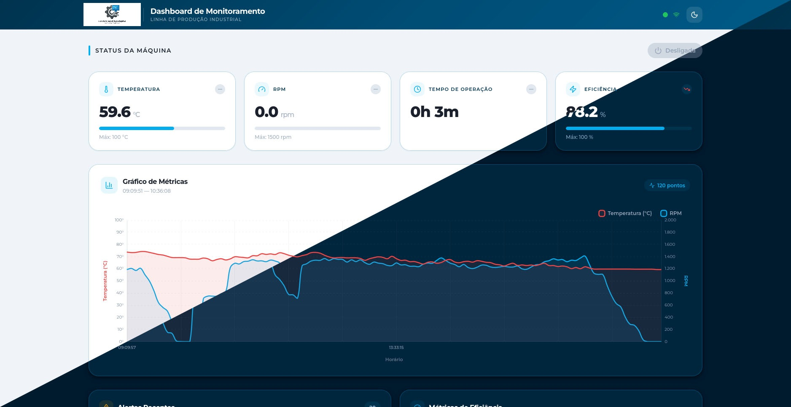
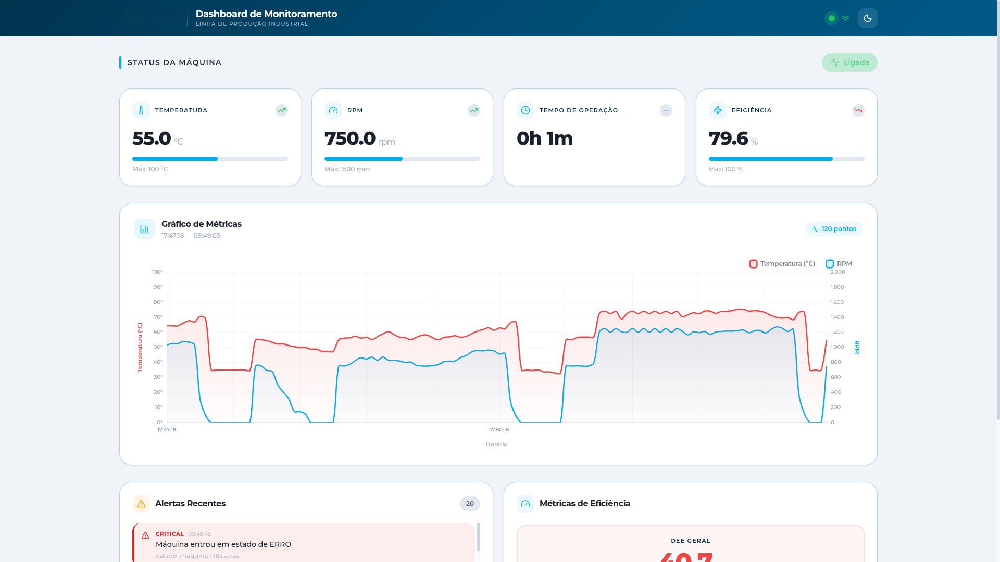
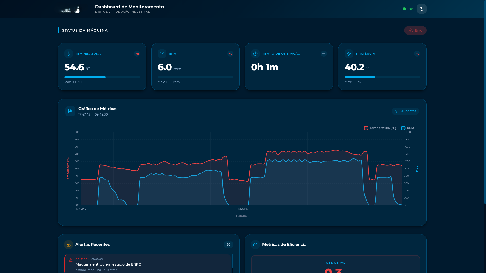
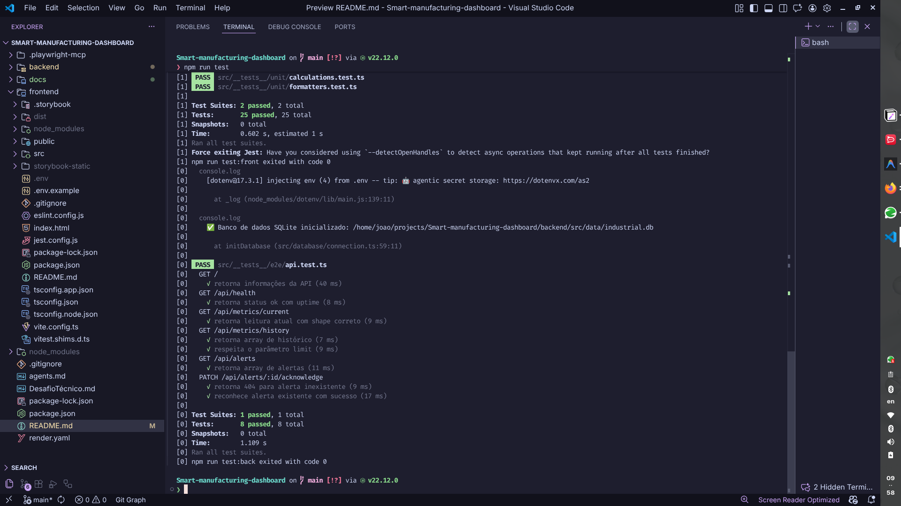
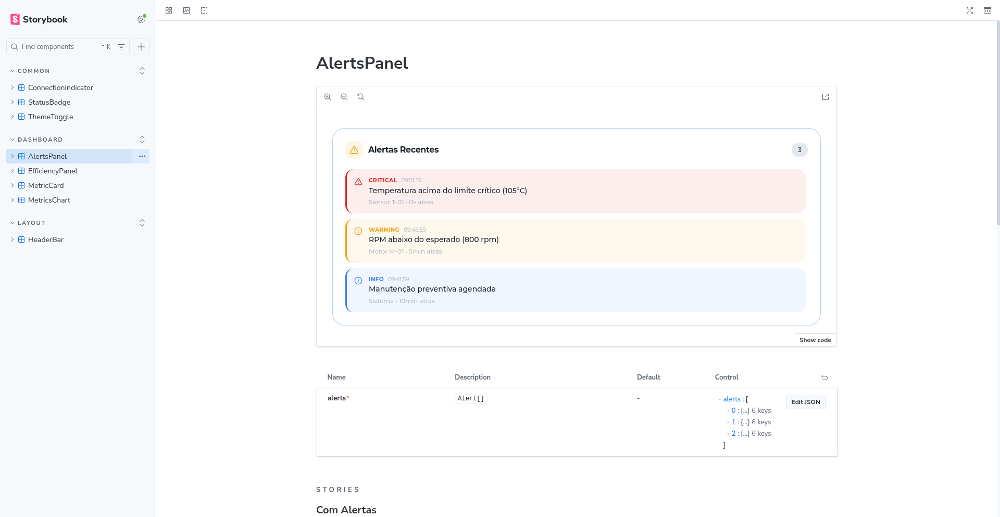

# 🏭 Dashboard de Monitoramento Industrial

<p align="center">
  
  
  
  
  
  
  
  
  
</p>

<div align="center">
  
</div>

## 🌐 Deploy em Produção

| Serviço             | URL                                                     |
| ------------------- | ------------------------------------------------------- |
| 🖥️ **Frontend**     | https://smart-dashboard-frontend.onrender.com/          |
| 🔌 **Backend**      | https://smart-dashboard-backend.onrender.com/           |
| 💚 **Health check** | https://smart-dashboard-backend.onrender.com/api/health |

> ℹ️ O backend roda no plano gratuito do Render.
> Após inatividade, ele pode entrar em sleep e levar alguns segundos para responder (cold start).

> 🔴 **Importante (primeiro acesso):**
>
> 1. Abra `https://smart-dashboard-backend.onrender.com/api/health` no navegador.
> 2. Aguarde a resposta do health check.
> 3. Em seguida, abra o frontend.

---

## 📚 Sumário

1. [Visão Geral](#-visão-geral)
2. [Quick Start](#-quick-start)
3. [Deploy em Produção](#-deploy-em-produção)
4. [Stack Tecnológica](#-stack-tecnológica)
5. [Estrutura do Projeto](#-estrutura-do-projeto)
6. [Funcionalidades](#-funcionalidades)
7. [Regras de Negócio](#-regras-de-negócio)
8. [API REST](#-api-rest)
9. [Componentes React](#-componentes-react)
10. [Decisões de Arquitetura](#-decisões-de-arquitetura)
11. [Testes](#-testes)
12. [Galeria de Capturas](#%EF%B8%8F-galeria-de-capturas)
13. [Documentação Complementar](#-documentação-complementar)

---

## ✨ Visão Geral

Sistema de monitoramento industrial focado em uma máquina específica da linha de produção. O backend gera leituras contínuas via **simulação Random Walk** e persiste no SQLite. O frontend consome a API via **short polling** (3s) e renderiza o estado operacional em tempo real.

### 🔄 Fluxo do Sistema

```
┌─────────────────┐     setInterval(3s)      ┌──────────┐
│  Simulador      │ ──────────────────────▶   │  SQLite  │
│  (Random Walk)  │                           │  (data/) │
└─────────────────┘                           └─────┬────┘
                                                    │
┌─────────────────┐     GET /api/metrics     ┌──────┴────┐
│  React          │ ◀──────────────────────  │  Express  │
│  Dashboard      │      fetch (3s)          │  API REST │
└─────────────────┘                          └───────────┘
```

---

## 🚀 Quick Start

### Pré-requisitos

- **Node.js** 18+ (recomendado: 22 LTS)
- **npm** 9+

### Instalação

````bash
# 1. Clonar o repositório
git clone https://github.com/seu-usuario/FULLSTACK_CHALLENGER.git
cd FULLSTACK_CHALLENGER

# 2. Instalar dependências (backend + frontend)
Para instalar tudo de uma vez com o script raiz:
```bash
npm run install:all
````

### Execução

```bash
# Iniciar backend + frontend simultaneamente
npm run dev
```

- 🖥️ **Frontend**: http://localhost:5173
- 🔌 **API**: http://localhost:3001/api
- 💚 **Health check**: http://localhost:3001/api/health

### Execução separada

```bash
# Terminal 1 — Backend
cd backend && npm run dev

# Terminal 2 — Frontend
cd frontend && npm run dev
```

---

## 🧰 Stack Tecnológica

| Camada      | Tecnologia                        | Versão      |
| ----------- | --------------------------------- | ----------- |
| Frontend    | ⚛️ React + TypeScript             | 19.x / ~5.9 |
| Build       | ⚡ Vite                           | 6.x         |
| Estilização | 🎨 Tailwind CSS                   | 4.x         |
| Gráficos    | 📊 Chart.js + react-chartjs-2     | 4.x / 5.x   |
| Ícones      | 🔷 Lucide React                   | latest      |
| HTTP Client | 🔗 Axios                          | latest      |
| Backend     | 🟢 Node.js + Express + TypeScript | —           |
| Banco       | 🗄️ SQLite (better-sqlite3)        | —           |
| Runner      | 🏃 tsx (dev)                      | latest      |
| Testes      | 🧪 Jest + React Testing Library   | —           |
| Storybook   | 📖 Storybook                      | 8.x         |
| Monorepo    | 🔀 Scripts `concurrently`         | ^8.2        |

---

## 🗂️ Estrutura do Projeto

```text
projeto/
├── backend/
│   ├── src/
│   │   ├── index.ts                # Bootstrapping: DB → Express → Simulador
│   │   ├── app.ts                  # Configuração Express (sem side-effects)
│   │   ├── __tests__/
│   │   │   └── e2e/
│   │   │       └── api.test.ts      # ★ Testes E2E da API REST
│   │   ├── config/
│   │   │   └── types.ts            # ★ Interfaces, enums, DTOs (única fonte de verdade)
│   │   ├── core/                   # ★ Lógica pura — NUNCA importa infra
│   │   │   ├── oee-calculator.ts   # Cálculo OEE = Disp × Perf × Qual
│   │   │   ├── rules-engine.ts     # Motor de regras (thresholds → alertas)
│   │   │   └── state-policy.ts     # Máquina de estados (transições válidas)
│   │   ├── controllers/            # Rotas Express (parse req → service)
│   │   │   ├── metrics.ts          # GET /current, GET /history
│   │   │   ├── alerts.ts           # GET /, PATCH /:id/acknowledge
│   │   │   └── health.ts           # GET /health
│   │   ├── database/
│   │   │   └── connection.ts       # Conexão SQLite + criação de tabelas
│   │   ├── middleware/
│   │   │   └── error-handler.ts    # Handler centralizado de erros
│   │   ├── repositories/
│   │   │   └── metrics-repository.ts  # Queries SQL isoladas
│   │   ├── routes/
│   │   │   └── index.ts            # Mapeamento centralizado de rotas
│   │   ├── services/
│   │   │   ├── simulator.ts        # ★ Motor de simulação (Random Walk)
│   │   │   ├── metrics-service.ts  # Montagem de MetricResponse + trends
│   │   │   └── alerts-service.ts   # Consulta e acknowledge de alertas
│   │   └── data/                   # SQLite gerado em runtime (gitignored)
│   ├── package.json
│   └── tsconfig.json
├── frontend/
│   ├── src/
│   │   ├── App.tsx                 # Orquestrador do layout (grid principal)
│   │   ├── main.tsx                # Ponto de entrada do React
│   │   ├── assets/
│   │   │   ├── index.css           # ★ Design system tokens (@theme + .dark)
│   │   │   └── logo.svg            # Logo STW
│   │   ├── components/
│   │   │   ├── common/             # Componentes reutilizáveis (sem lógica de API)
│   │   │   │   ├── ConnectionIndicator.tsx
│   │   │   │   ├── StatusBadge.tsx
│   │   │   │   └── ThemeToggle.tsx
│   │   │   ├── dashboard/          # Painéis especializados do dashboard
│   │   │   │   ├── MetricCard.tsx
│   │   │   │   ├── MetricsChart.tsx
│   │   │   │   ├── AlertsPanel.tsx
│   │   │   │   └── EfficiencyPanel.tsx
│   │   │   └── layout/
│   │   │       └── HeaderBar.tsx
│   │   ├── hooks/
│   │   │   └── useMachineData.ts   # ★ Hook de polling (Smart Layer)
│   │   ├── plugins/
│   │   │   └── axios.ts            # Configuração base do HTTP client
│   │   ├── services/               # Camada de fetch/API
│   │   │   └── api.ts
│   │   ├── types/                  # Interfaces TypeScript (espelho back)
│   │   │   └── index.ts
│   │   ├── __tests__/
│   │   │   └── unit/
│   │   │       ├── formatters.test.ts   # ★ Testes de formatação
│   │   │       └── calculations.test.ts # ★ Testes de cálculos
│   │   └── utils/
│   │       ├── calculations.ts     # Funções de cálculo
│   │       └── formatters.ts       # Formatação (RPM, Temp, Uptime, %)
│   ├── index.html
│   ├── package.json
│   └── vite.config.ts
├── docs/
│   ├── PROJECT_BLUEPRINT.md        # Blueprint completo do projeto
│   ├── DECISOES_TECNICAS.md        # Justificativas arquiteturais
│   └── rules/
│       ├── agents_front.md         # Regras IA para frontend
│       └── agents_back.md          # Regras IA para backend
├── agents.md                       # Ponto de entrada para os agents
├── render.yaml                     # Blueprint de deploy no Render
├── package.json                    # Scripts raiz (concurrently)
└── README.md
```

---

## ⚙️ Funcionalidades

- ✅ Monitoramento de estado da máquina em **tempo real** (RUNNING, STOPPED, MAINTENANCE, ERROR)
- ✅ Cards de métricas com **tendência** (↑↓→) e **semáforo por threshold**
- ✅ Gráfico histórico de **temperatura** e **RPM** (Chart.js, dual Y-axes)
- ✅ Painel de eficiência com **OEE consolidado** (availability, performance, quality)
- ✅ Sistema de alertas com **3 níveis** (INFO, WARNING, CRITICAL) e cooldown
- ✅ Indicador de **perda de conexão** com banner e retorno automático
- ✅ Tema **dark/light** com persistência em localStorage
- ✅ Layout **responsivo** (desktop, tablet, mobile)
- ✅ Backend com **simulador paralelo** (Random Walk em setInterval)
- ✅ Dados persistidos em **SQLite** com histórico consultável

---

## 🧠 Regras de Negócio

### Máquina de Estados

| De          | Para        | Descrição            |
| ----------- | ----------- | -------------------- |
| STOPPED     | RUNNING     | Ligar máquina        |
| RUNNING     | STOPPED     | Desligar normalmente |
| RUNNING     | ERROR       | Falha operacional    |
| ERROR       | MAINTENANCE | Entrar em manutenção |
| MAINTENANCE | STOPPED     | Concluir manutenção  |
| MAINTENANCE | RUNNING     | Liberar diretamente  |

### Thresholds

| Métrica     | Condição            | Alerta   |
| ----------- | ------------------- | -------- |
| Temperatura | > 85°C              | CRITICAL |
| Temperatura | > 80°C e ≤ 85°C     | WARNING  |
| Temperatura | < 20°C              | INFO     |
| RPM         | > 1500 (em RUNNING) | CRITICAL |
| RPM         | < 800 (em RUNNING)  | WARNING  |
| RPM         | = 0 (em RUNNING)    | CRITICAL |

### Cálculo de OEE

```
availability = tempo_running / tempo_planejado
performance  = rpm_real / rpm_teórico (1500)
quality      = peças_boas / peças_totais
OEE          = availability × performance × quality
```

### Simulador — Comportamento por Estado

| Estado      | Temperatura                | RPM                    | Comportamento Especial             |
| ----------- | -------------------------- | ---------------------- | ---------------------------------- |
| RUNNING     | 60-90°C, variação ±2/ciclo | 800-1500, variação ±50 | Operação normal                    |
| STOPPED     | Desce para ~25°C           | Tende a 0              | Máquina parada, sem alertas de RPM |
| MAINTENANCE | Estável ~30°C              | 0 fixo                 | Gera alertas INFO de manutenção    |
| ERROR       | Pico até 95°C              | Queda abrupta          | Risco operacional máximo           |

- **Ciclo**: `setInterval` de 3 segundos
- **Motor**: Random Walk com limites físicos
- **Pruning**: a cada 10 ciclos (~30s) limpa registros antigos do banco
- **Cooldown de alertas**: 60 segundos entre alertas com mesma chave

---

## 🌐 API REST

| Rota                                | Método | Descrição                              |
| ----------------------------------- | ------ | -------------------------------------- |
| `GET /api/metrics/current`          | GET    | Última leitura + estado + OEE + trends |
| `GET /api/metrics/history`          | GET    | Últimas 120 leituras (gráfico)         |
| `GET /api/alerts`                   | GET    | Alertas ordenados por severidade       |
| `PATCH /api/alerts/:id/acknowledge` | PATCH  | Reconhecer alerta                      |
| `GET /api/health`                   | GET    | Status do servidor + uptime            |

---

## 🎨 Componentes React

| Componente            | Função                                                      |
| --------------------- | ----------------------------------------------------------- |
| `HeaderBar`           | Logo, título, status badge, indicador conexão, theme toggle |
| `StatusBadge`         | Estado da máquina com cor e animação por estado             |
| `ConnectionIndicator` | Bolinha verde/vermelha com ping animation                   |
| `MetricCard`          | Valor + tendência + barra de progresso + threshold colors   |
| `MetricsChart`        | Chart.js dual-axis (temperatura °C + RPM)                   |
| `AlertsPanel`         | Lista de alertas com severidade, cores e timestamps         |
| `EfficiencyPanel`     | OEE geral + barras de availability/performance/quality      |
| `ThemeToggle`         | Botão sol/lua com persistência localStorage                 |

---

## 🏗️ Decisões de Arquitetura

As decisões técnicas estão documentadas em detalhes no arquivo [docs/DECISOES_TECNICAS.md](docs/DECISOES_TECNICAS.md). Resumo:

1. **Short Polling** no lugar de WebSocket (MVP, mas preparado para migração)
2. **better-sqlite3** sem ORM (controle total, performance máxima)
3. **Monorepo simples** com `concurrently` (sem Turborepo)
4. **Chart.js** para gráficos (leve, integrado com React)
5. **Tailwind CSS v4 puro** (sem biblioteca de componentes)
6. **Random Walk** para simulação realista de sensores
7. **Deploy no Render** — plano gratuito, front + back centralizados

### Arquitetura Backend — Padrão em Camadas

| Camada          | Responsabilidade                              | Regra de Importação                             |
| --------------- | --------------------------------------------- | ----------------------------------------------- |
| `config/`       | Tipos, interfaces, constantes                 | Pode ser importado por qualquer camada          |
| `core/`         | Lógica pura de negócio (OEE, regras, estados) | **NUNCA** importa infra (express, sqlite, etc.) |
| `database/`     | Conexão SQLite, criação de schema             | Importa apenas `better-sqlite3` e `config/`     |
| `repositories/` | Queries SQL isoladas (único lugar com SQL)    | Importa `database/` e `config/`                 |
| `services/`     | Orquestração: une core com repositories       | Importa `core/`, `repositories/`, `config/`     |
| `controllers/`  | Parse de request + delegação para services    | Importa `services/` e `config/`                 |

```
Request → routes/ → Controller → Service → { Core (regras) + Repository (dados) } → Response
```

### Arquitetura Frontend — Smart vs. Dumb

- **Componentes** (`components/`): recebem dados via props e apenas exibem ("burros").
- **Hook** (`useMachineData`): encapsula toda a lógica de polling, estado e reconexão.
- **Separação**: `hooks/` para lógica, `components/` para UI, `services/` para API, `utils/` para formatação.

---

## ✅ Testes

O projeto usa **Jest + Supertest** no backend e **Jest + React Testing Library** no frontend. Os testes ficam organizados em pastas `__tests__/` com subdivisão por tipo.

### Estrutura de Testes

```text
backend/src/__tests__/
└── e2e/
    └── api.test.ts          # Testes E2E da API REST (8 testes)
                              # Health, métricas, histórico, alertas, acknowledge

frontend/src/__tests__/
└── unit/
    ├── formatters.test.ts   # Testes unitários de formatação (9 testes)
    │                         # formatUptime, formatTimestamp, timeAgo, formatMetric
    └── calculations.test.ts # Testes unitários de cálculos (16 testes)
                              # getValueColor, getOEEColor, getProgressPercent, getTrendLabel
```

### Comandos

```bash
# Rodar todos os testes (backend + frontend)
npm test

# Backend apenas (Jest + Supertest)
cd backend && npm test

# Frontend apenas (Jest)
cd frontend && npm test
```

### Cobertura

| Camada    | Framework        | Tipo     | Testes | Descrição                                            |
| --------- | ---------------- | -------- | ------ | ---------------------------------------------------- |
| Backend   | Jest + Supertest | E2E      | 8      | Endpoints REST: health, metrics, alerts, acknowledge |
| Frontend  | Jest + RTL       | Unitário | 25     | Funções puras de formatação e cálculo                |
| **Total** |                  |          | **33** |                                                      |

---

## 🖼️ Galeria de Capturas

Aqui estão as evidências do projeto funcionando em diferentes estados:

### Dashboard (Formato 16:9)

| Tema Claro                               | Tema Escuro                                  |
| :--------------------------------------- | :------------------------------------------- |
|  |  |

### Dashboard — Visão Geral


### Testes — Cobertura Completa



### Storybook & Documentação



---

## 📎 Documentação Complementar

| Documento                                                | Conteúdo                                    |
| -------------------------------------------------------- | ------------------------------------------- |
| [docs/PROJECT_BLUEPRINT.md](docs/PROJECT_BLUEPRINT.md)   | Blueprint completo do projeto               |
| [docs/DECISOES_TECNICAS.md](docs/DECISOES_TECNICAS.md)   | Justificativas de cada escolha arquitetural |
| [docs/rules/agents_back.md](docs/rules/agents_back.md)   | Regras de arquitetura do backend            |
| [docs/rules/agents_front.md](docs/rules/agents_front.md) | Regras de design system e componentes       |

---

## 🎨 Paleta de Cores (STW)

### Cores Primárias STW

| Token                   | Hex       | Uso                                  |
| ----------------------- | --------- | ------------------------------------ |
| `--color-stw-primary`   | `#00AEEF` | Accent blue — ícones, badges, barras |
| `--color-stw-dark`      | `#00334E` | Navy — headings (light mode)         |
| `--color-stw-secondary` | `#005A87` | Mid-blue — interações secundárias    |
| `--color-stw-corporate` | `#004C74` | Corporate — gradiente header, bordas |
| `--color-stw-light`     | `#0085C8` | Azul claro — hovers, destaques       |
| `--color-stw-navy`      | `#001A2E` | Navy profundo — fundo dark mode      |

### Cores de Estado

| Estado         | Hex       | Uso                           |
| -------------- | --------- | ----------------------------- |
| 🟢 Running     | `#22C55E` | Estado ligada, conexão OK     |
| ⚪ Stopped     | `#94A3B8` | Estado parada                 |
| 🟡 Maintenance | `#F59E0B` | Manutenção, alertas warning   |
| 🔴 Error       | `#EF4444` | Estado erro, alertas críticos |

---

## 💬 Mensagem Final

Este projeto demonstra domínio técnico em:

- **Arquitetura**: monorepo, separação de responsabilidades, design patterns.
- **Backend**: simulação assíncrona, SQL nativo, API REST bem definida.
- **Frontend**: componentes reutilizáveis, hooks customizados, responsividade.
- **UX**: animações funcionais, dark mode, alertas priorizados, feedback visual.

Recomendo começar a análise por:

1. [docs/DECISOES_TECNICAS.md](docs/DECISOES_TECNICAS.md) — entenda as escolhas
2. [docs/PROJECT_BLUEPRINT.md](docs/PROJECT_BLUEPRINT.md) — blueprint completo
3. [backend/src/services/simulator.ts](backend/src/services/simulator.ts) — o coração do sistema
4. [frontend/src/hooks/useMachineData.ts](frontend/src/hooks/useMachineData.ts) — a ponte front-back
